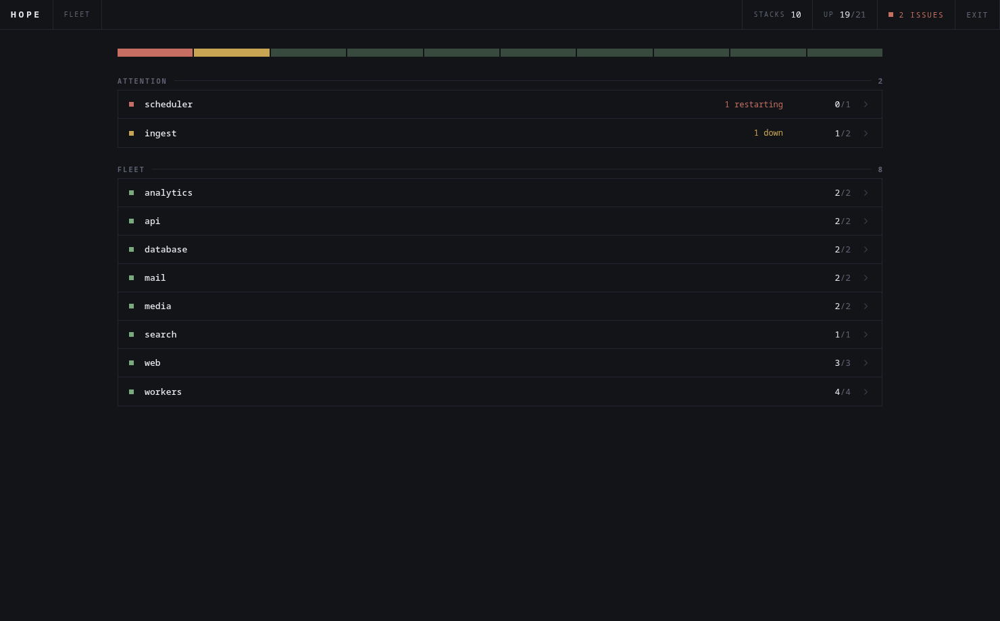
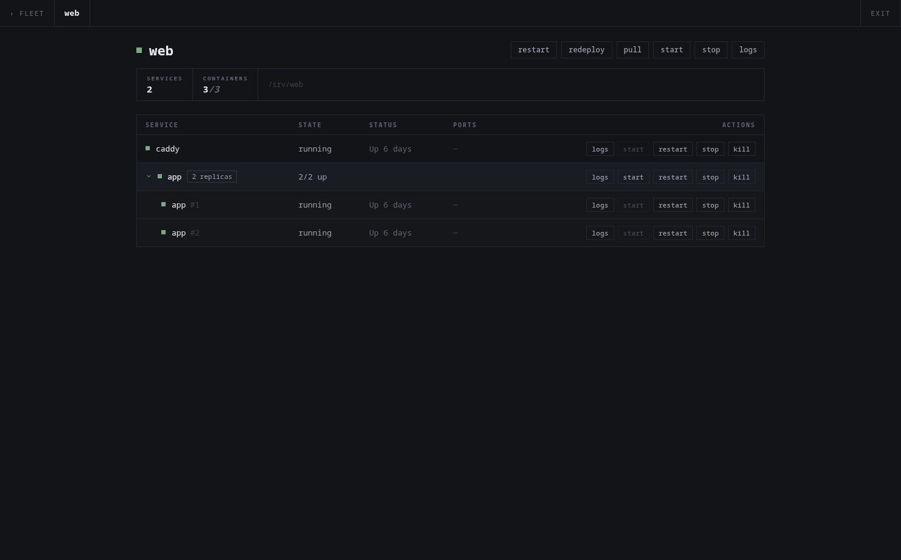
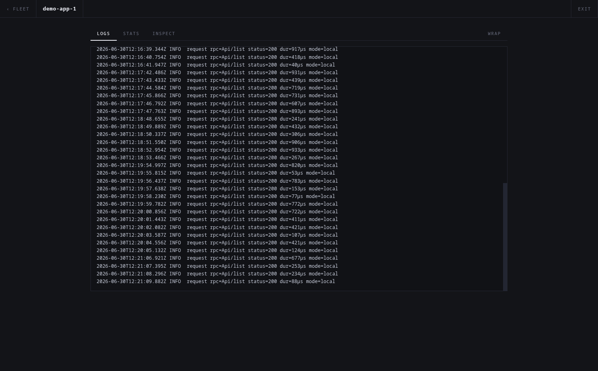

# hope

A clean, self-hostable manager for a Docker Compose cluster. One Go binary
([sov](https://github.com/Toyz/sov) backend) embeds a [loom](https://github.com/Toyz/loom)
frontend, reads Docker Compose labels to group containers into stacks, and drives
full stack lifecycle — all over the Docker API, so it works against a local
socket or a remote daemon with no compose files on disk.

> Screenshots below use a demo dataset — not a real cluster.



| Stack control + replica grouping | Streaming logs |
| --- | --- |
|  |  |

## Features

- **Mission-control overview** — every stack at a glance; trouble lights up, the
  rest stays quiet. A fleet ribbon + synthesized health verdict.
- **Stack control** — start / stop / restart / pull / redeploy per stack, and per
  container, driven entirely through the Docker API (no `docker compose` shell-out,
  no mounted compose files). Redeploy pulls images and recreates containers in
  place, preserving config, networks, and compose labels.
- **Replica grouping** — services with multiple containers collapse into one row
  with bulk actions; expand for per-replica control.
- **Live logs & stats** — per container, per service (all replicas multiplexed and
  source-tagged), or the whole stack. Streamed as NDJSON; auto-scroll + wrap toggle.
- **Private registry pulls** — reads a Docker `config.json` so `pull`/`redeploy`
  authenticate to private registries (e.g. ghcr).
- **Guarded destructive actions** — stop / kill / redeploy require confirmation.
- **Single login** — username/password from config; stateless HMAC bearer tokens.
- **Optional socket proxy** — expose the Docker API to a trusted LAN behind a
  method/path allowlist.

## Quick start

```sh
cp config.example.toml config.toml   # then edit: username, password, token_secret
cp docker-compose.example.yml docker-compose.yml
docker compose up -d --build
```

Open `http://<host>:8080` and sign in. hope reaches the daemon through the mounted
`/var/run/docker.sock`.

## Configuration

See [config.example.toml](config.example.toml). Every key can be overridden with a
`HOPE_*` env var (e.g. `HOPE_AUTH_PASSWORD`). Key sections:

- `[auth]` — `username`, `password` (plaintext or a `$2…` bcrypt hash), and a long
  random `token_secret`.
- `[docker] host` — `unix:///var/run/docker.sock` or a remote `tcp://host:2375`.
  `config` optionally points at a Docker `config.json` for registry credentials
  (defaults to `~/.docker/config.json`).
- `[socketproxy]` — opt-in LAN proxy; **read-only by default**.
- `[log]` — `color` / `json`.

## Security

- Mounting the Docker socket grants **root-equivalent control of the host** to the
  hope container. Run it only on a trusted network (LAN / overlay like ZeroTier),
  behind its login — not on a public interface.
- The socket proxy is the same exposure to whoever reaches its port. It defaults to
  read-only (`GET`/`HEAD`); only allowlist writes deliberately, and never route it
  through a public tunnel.

## Development

Backend (live reload with [air](https://github.com/air-verse/air)):

```sh
air            # builds ./cmd/hope, restarts on change (uses ./config.toml)
```

Frontend (Vite dev server, proxies `/rpc` to the backend on `:8080`):

```sh
cd frontend && npm install && npm run dev
```

## Build

```sh
cd frontend && npm run build      # outputs frontend/dist (embedded by the binary)
go build -o hope ./cmd/hope       # single self-contained binary
```

Or build the image: `docker build -t hope .`. If `github.com/Toyz/sov` is private,
pass build credentials (see the [Dockerfile](Dockerfile) header).

## Architecture

- **Backend** (`cmd/hope`, `internal/*`): sov gateway. `internal/docker` wraps the
  Docker SDK and groups containers by compose label; `internal/stacks`,
  `internal/containers`, `internal/system` are RPC routers; `internal/auth` is the
  sov `AuthService`; `internal/plugins/logstream` streams NDJSON logs/stats;
  `internal/plugins/logger` is the unified request logger; `internal/socketproxy`
  is the optional LAN proxy. The built SPA is embedded via `go:embed`.
- **Frontend** (`frontend/`): loom + loom-rpc. A custom `RpcTransport` adds the
  bearer token and implements `stream()` over the NDJSON routes. Pages: login,
  dashboard (mission control), stack detail, container detail.

## License

MIT — see [LICENSE](LICENSE).
